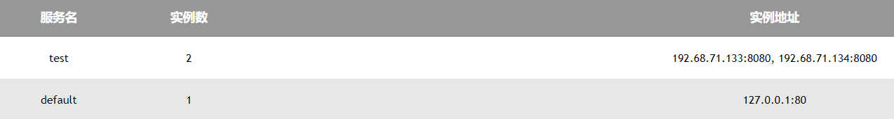

# 快速启动
## 1.下载发行版本

## 2.启动程序
```
./lg-linux -port 8080
```
-port用于指定light-gate的运行端口,默认运行于8080.

## 3.配置微服务
### 3.1 手动配置
向light-gate发送心跳,间隔5s发送一次
>POST  http://ip:port/heartbeat
> 
>请求体: (application/json)
> 
>{"name": "default","ip": 8080}
### 3.2 引入代码自动配置
#### A.springboot框架
新建HeartBeat.java文件
```
import org.springframework.beans.factory.annotation.Autowired;
import org.springframework.beans.factory.annotation.Value;
import org.springframework.boot.web.client.RestTemplateBuilder;
import org.springframework.scheduling.annotation.Scheduled;
import org.springframework.stereotype.Component;
import org.springframework.web.client.RestTemplate;

@Component
public class HeartBeat {
    @Value("${server.port}")
    public String port;
    private String serviceName = "default";
    public String url = "localhost:8080";
    private RestTemplate restTemplate;
    @Autowired
    public void setRestTemplate(RestTemplateBuilder builder) {
        this.restTemplate = builder.build();
    }

    @Scheduled(fixedRate = 5000)
    public void sendHeartBeat() {
        HeartBeatDto dto = new HeartBeatDto();
        dto.setPort(port);
        dto.setName(serviceName);
        String fullPath = "http://" + url + "/heartbeat";
        restTemplate.postForObject(fullPath, dto, String.class);
    }

    @Data
    private static class HeartBeatDto {
        String name;
        String port;
    }
}
```
B.gin框架
需要把Run函数放到main函数里触发一下
参数说明

| 参数  | 说明                          |
|-----|-----------------------------|
| lightGateUrl | lightGate运行的地址,格式形如 ip:port |
| port | 当前微服务监听的端口                  |
| serviceName | 当前微服务的名称                    |
| ssl | lightGate是否开启了https         |
```
var lightGateUrl = "ip:8080"
var port = "8081"
var serviceName = "file"
var ssl = true

func Run() {
	serviceCron := cron.New()
	err := serviceCron.AddFunc("*/6 * * * * ?", func() {
		send()
	})
	if err != nil {
		return
	}
	serviceCron.Start()
}

func send() {
	client := &http.Client{}

	data := "{\"name\": \"" + serviceName + "\",\"port\": \"" + port + "\"}"
	body := bytes.NewBuffer([]byte(data))
	var url string
	if ssl {
		url = "https://" + lightGateUrl + "/heartbeat"
	} else {
		url = "http://" + lightGateUrl + "/heartbeat"
	}
	myRequest, err := http.NewRequest("POST", url, body)
	if err != nil {
		return
	}
	respose, err := client.Do(myRequest)
	if err != nil {
		fmt.Println(respose)
	}
}
```
## 4.SSL支持
在light-gate程序所在位置创建conf文件夹,下载crt和key格式证书放入conf文件夹并改名server.

light-gate在启动时会检测是否存在ssl证书信息,存在则开启https模式,否则开启http模式.

目录结构如下:
```
...
│   lg_linux_linux
│   lg_windows.exe
│
└───conf
        server.crt
        server.key
```
## 5.查看服务运行情况
访问http(s)://ip:port/home路径,可以看到如下界面:

# 项目说明
## 1.概述
是一个用gin框架构建的负载均衡器，服务通过向负载均衡器发送心跳来注册自己，负载均衡器会在活跃服务里选择一个处理请求.它运行只需要6MB内存!
## 2.注册策略
10s内负载均衡器接收不到心跳将会下线服务。
## 3.负载均衡策略
目前只支持轮询。
## 4.代理规范
代理路径规范：
```
http://ip:port/serviceName/url...
```

只转发形如/*/**的二层以上的路径。形如/*的单层路径是lightgate的保留路径。

在转发时，会去除服务名称，只转发上面的url...部分。
## 5.支持
（虽然大概率没人用）但是如果您需要支持，欢迎联系。besides，本项目也会持续更新。